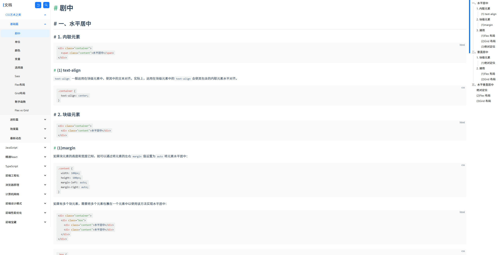

这是一个查看文档的仓库，使用vite-public-md解析.md文件作为路由页面
- node 16.x
- vue3 + vite + ts
```
.
├── src
│   ├── assets
│   │   ├── markdown.css
│   │   ├── prism.css
│   ├── components
│   │   ├── RouterPage.vue
│   ├── Markdowns
│   │   ├── name.md
│   ├── router
│   │   ├── mds.ts
│   │   ├── pages.ts
│   │   ├── index.ts
│   ├── views
│   │   ├── Home
│   │   ├── Question
│   │   ├── Study
```




- **Markdowns** 下的文件名和 **router/mds** 的数据中 **routerKey**一致；

- **assets/markdown.css** 用于markdown解析样式；

- **assets/prism.css** 用于代码高亮样式；

- **router/pages.ts** 路由配置
- **router/mds.ts** md数据跟随着Markdowns下的文件名字和数据的routerKey
    - 这个数据影响全局的
    - 有首页的饼图
    - 内容页面的菜单
    - 路由页面的配置
    > router/page.ts 和 mds.ts 能明白到底是什么东西
- **src/components/RouterPage.vue** 内容页面的组件，后面可能会拆分3部分