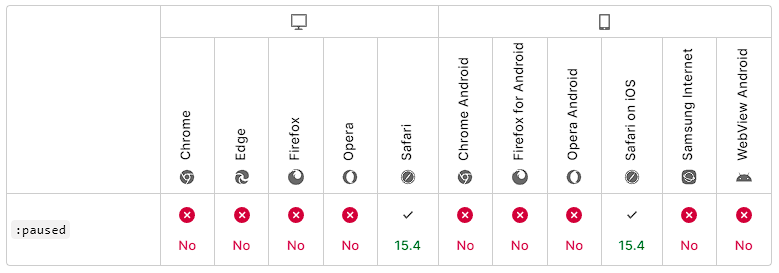
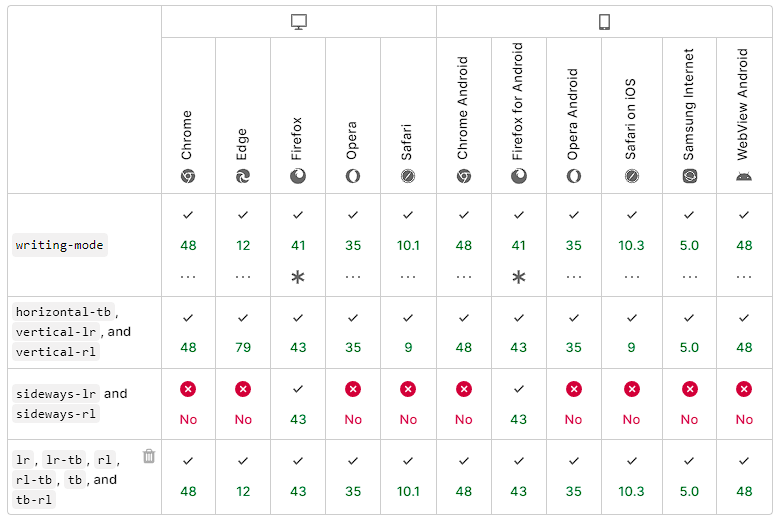
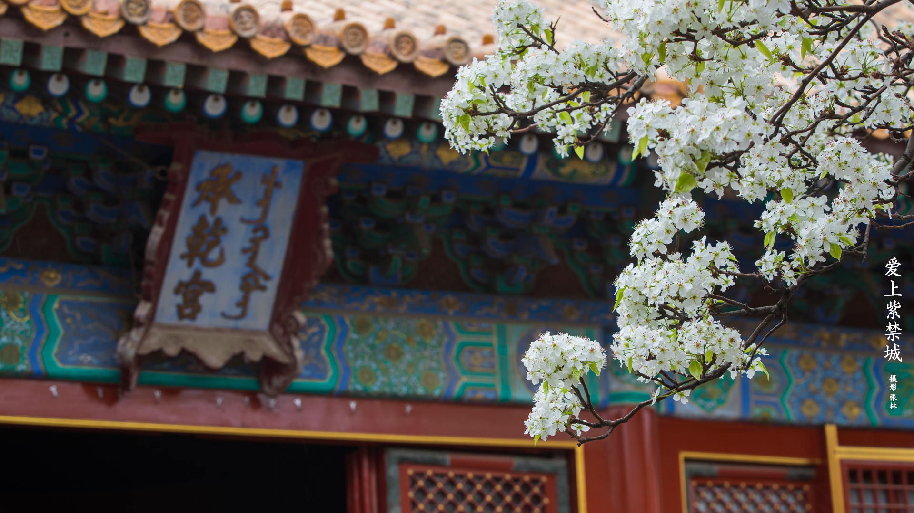

# 技巧

## 图像填充文字效果
要想实现图像填充文字效果，可以设置 `background-clip: text` 以使文字背景作为整个区域的背景，文字之外的区域将被裁掉。配合透明的文字颜色，就可以实现图像填充文字效果了：
<div class='jq_div'>世界很美好感谢有你</div>
<style>
.jq_div {
background-image: url('./images/CSS_进阶_技巧/bg.png');
background-clip: text;
-webkit-background-clip: text;
color: transparent;
background-color: #fff;
font-size:20px;
font-weight:800;
}
</style>

```css
.jq_div {
    background-image: url('.images/CSS_进阶_技巧/bg.png');
    background-clip: text;
    -webkit-background-clip: text;
    color: transparent;
    background-color: white;
    font-size:20px;
    font-weight:800;
}
```
> 注意，在使用此技术时可以指定一个背景颜色来作为后备值，以防图像因为某种原因而无法加载。

## 文字描边效果
在 CSS 中可以使用 `text-stroke` 属性使文本更易读，它会向文本添加轮廓效果。
<div class='textStrokeDemo'>世界很美好感谢有你</div>
<style>
.textStrokeDemo {
    color: #fff;
	font-size: 40px;
    -webkit-text-stroke: 2px crimson;
    text-stroke: 2px crimson;
}
</style>

```css
.textStrokeDemo {
    color: #fff;
    font-size: 40px;
    -webkit-text-stroke: 2px crimson;
    text-stroke: 2px crimson;
}
```

> 注意，**text-stroke** 属性值中有两部分，第一部分是文字描边的宽度，第二部分是文字描边的颜色。

## 暂停/播放伪类

使用 `:paused` 伪类可以为处于暂停状态的媒体元素设置样式，那自然就还有 `:playing` 伪类，它可以为处于播放状态的媒体元素设置样式。

<video class='videoDemo' src='https://v1.kwaicdn.com/upic/2023/11/08/18/BMjAyMzExMDgxODAyMzVfMjE2Mjk2NjM3Ml8xMTY3MzY3NTM0MTFfMV8z_hd15_Bd0eba63f4a347f10edcb24166e4db4ac.mp4?pkey=AAWExHz9UMkXxhoP2CCXv6_kwfzXELVa1DlKSlaBqsENVxYaifM3fY4M6WId8HyZXk4mhIujqjr69-PVIVSTYyuhCFjvkBPbpfgWkzTs-Jcwd5qwW_5ZeEn2q-XxbkMSB5g&tag=1-1706063982-unknown-0-sswhxfx1v3-8c14d0efebb1f928&clientCacheKey=3xrz2cundmgab79_hd15.mp4&di=9d77aeae&bp=10004&tt=hd15&ss=vp' controls width='240'></video>
<style>
.videoDemo:paused {
  opacity: 0.6;
}
.videoDemo:playing {
    border:1px solid skyblue;
}
</style>

```css
.videoDemo:paused {
  opacity: 0.6;
}
```

> 需要注意，目前仅 **Safari** 支持该伪类:paused：
> 


## 文本强调效果
可以使用 `text-emphasis` 属性将强调标记应用于文本元素。可以指定包括表情符号在内的任何字符串作为强调标记。
<div class='text_emphasis'>世界很美好感谢有你</div>
<style>
.text_emphasis {
  text-emphasis: "⭐️";
  font-size:18px;
  color:#1677ff;
}
</style>

```css
.text_emphasis {
  text-emphasis: "⭐️";
  font-size:18px;
  color:#1677ff;
}
```

>注意，**text-emphasis** 是一个简写属性，用于在一个声明中设置 **text-emphasis-style** 和 **text-emphasis-color**。强调装饰符的字号是主文字内容字号的一半，例如假设文字是20px，则上方的强调字符的大小是10px。

## 更写书写方向
通常我们常见的网页文字是从左向右布局的，在CSS中可以使用 `writing-mode` 属性来指定文本在网页上的布局方式，即水平或垂直。该属性有多个属性值：
- `horizontal-tb`：水平方向自上而下的书写方式。即 left-right-top-bottom
- `vertical-rl`：垂直方向自右而左的书写方式。即 top-bottom-right-left
- `vertical-lr`：垂直方向内内容从上到下，水平方向从左到右
- `sideways-rl`：内容垂直方向从上到下排列
- `sideways-lr`：内容垂直方向从下到上排列
<div class='writing_mode'>世界很美好感谢有你</div>
<style>
.writing_mode{
    writing-mode: vertical-lr;
    color:#1677ff;
}
</style>

```css
.writing_mode{
    writing-mode: vertical-lr;
    color:#1677ff;
}
```
> **sideways-rl**，**sideways-lr** 兼容堪忧，不推荐使用。
> 

## 悬停缩放效果
<div class='img-container'>
    
</div>
<style>
.img-container {
   height: 360px;
   width: 640px;
   overflow: hidden;
}
.img-container img {
   height: 100%;
   width: 100%;
   object-fit: cover; 
   transition: all .2s ease-in;
 }
 .img-container img:hover {
   transform: scale(1.2);
 }
</style>

```html
<div class='img-container'>
    
</div>
<style>
.img-container {
   height: 360px;
   width: 640px;
   overflow: hidden;
}
.img-container img {
   height: 100%;
   width: 100%;
   object-fit: cover; 
   transition: all .2s ease-in;
 }
 .img-container img:hover {
   transform: scale(1.2);
 }
</style>
```
>transform 属性应用于元素的2D或3D转换。这个属性允许将元素旋转，缩放，移动，倾斜等。当值为scale就可以实现元素的 2D 缩放转换。

## 裁剪各种形状
可以使用 `clip-path` 属性来创建各种有趣的视觉效果，例如将元素剪裁成自定义形状，如三角形或六边形。


```css
.clip_path {
  height: 150px;
  width: 150px;
  background-color: crimson;
}
```
**三角形**
<div class='clip_path1'></div>
<style>
.clip_path1 {
  height: 150px;
  width: 150px;
  background-color: crimson;
  clip-path: polygon(50% 0%, 0% 100%, 100% 100%);
}
</style>

```css
clip-path: polygon(50% 0%, 0% 100%, 100% 100%);
```

**六边形**
<div class='clip_path2'></div>
<style>
.clip_path2 {
  height: 150px;
  width: 150px;
  background-color: crimson;
  clip-path: polygon(25% 0%, 75% 0%, 100% 50%, 75% 100%, 25% 100%, 0% 50%);
}
</style>

```css
  clip-path: polygon(25% 0%, 75% 0%, 100% 50%, 75% 100%, 25% 100%, 0% 50%);
```

> 可以使用 clip-path 在线工具在制作各种图形：https://bennettfeely.com/clippy/

> https://bennettfeely.com/ 一些其它css效果

## 检测属性支持
在 CSS 中可以使用 `@support` 规则来检测对 CSS 特性的支持：
```css
@supports (accent-color: #74992e) {
  .blockquote {
    color: crimson;
  }
}
```
如果支持该属性将运行内容定义的样式。

## 可选项样式
在 CSS 中可以使用 `:optional` 伪类来设置没有 `required` 属性的表单字段的样式，例如 `input`、`select` 和 `textarea`。
<div>
    <input class='kxx' value='无required'/>
    <input class='kxx' required value='有required'/>
</div>
<style>
    .kxx:optional {
        background-color: green;
        color:#fff;
    }
    .kxx{
        margin-right:10px;
    }
</style>

```html
<div>
    <input class='kxx' value='无required'/>
    <input class='kxx' required value='有required'/>
</div>
<style>
    .kxx:optional {
        background-color: green;
        color:#fff;
    }
    .kxx{
        margin-right:10px;
    }
</style>
```

## user-select
`user-select` 属性可以用来控制用户是否能够选择文本。
<div class='user_select1'>
世界很美好感谢有你-鼠标无法选中的
</div>
<div class='user_select2'>
世界很美好感谢有你
</div>
<style>
.user_select1{
width: max-content;
border: 3px solid purple;
user-select: none;
color:#1677ff;
}
.user_select2{
    color:#1677ff;
}
</style>

```html
<div class='user_select1'>
世界很美好感谢有你-鼠标无法选中的
</div>
<div class='user_select2'>
世界很美好感谢有你
</div>
<style>
.user_select1{
    width: max-content;
    border: 3px solid purple;
    user-select: none;
    color:#1677ff;
}
.user_select2{
    color:#1677ff;
}
</style>
```

> **解析：**`user-select` 属性用于控制用户是否能够选择文本。通过设置 `user-select` 属性，可以限制用户对文本的选择行为或禁止选择。该属性可以应用于任何 HTML 元素，并接受以下值：
> - `auto`：默认值，表示用户可以选择文本。
> - `none`：禁止用户选择文本。
> - `text`：允许用户选择文本，但不能选择元素的其他部分，如背景、边框等。
> - `all`：允许用户选择元素内的所有内容，包括文本、背景和边框。

> `user-select` 属性的应用场景通常涉及到用户交互和用户体验的控制，可以在以下情况下使用该属性：
> 1. **防止文本被选中**：在某些情况下，你可能希望防止用户选择特定区域或元素内的文本，例如，防止用户选择输入框中的内容或防止复制敏感信息。通过将 `user-select` 设置为 none，可以禁止用户选择这些文本，从而保护数据的安全性。
> 2. **控制文本选择范围**：有时你可能只希望用户能够选择特定的文本内容，而不包括其他元素中的样式信息。通过将 `user-select` 设置为 text，可以限制用户只能选择文本内容，而不能选择其他元素的样式信息，从而提供更精确的文本选择控制。
> 3. **自定义选择效果**：使用 `user-select` 属性，你还可以自定义文本选择的外观效果。通过设置适当的 CSS 样式，如更改选中文本的背景色、前景色等，可以为用户提供独特的文本选择体验，增强页面的可视化效果。
> 4. **取消文本选择**：在某些特定情况下，你可能希望用户无法选择任何文本，以防止复制、截屏等操作。通过将 `user-select` 设置为 none，可以完全禁止用户选择文本，从而实现取消文本选择的效果。

## pointer-events
可以使用 `pointer-events` 属性来控制元素对指针事件的反应。
<div class='pointer-events-demo1'>
    <a href='https://developer.mozilla.org/zh-CN/docs/Web/CSS/pointer-events' target='_blank'>这是设置pointer-events的；这是一个超链接，点击跳转mdn#pointer-events</a>
</div>
<div class='pointer-events-demo2'>
    <a href='https://developer.mozilla.org/zh-CN/docs/Web/CSS/pointer-events' target='_blank'>这是正常的 这是一个超链接，点击跳转mdn#pointer-events</a>
</div>
<style>
.pointer-events-demo2 a{
    color:#1677ff;
}
.pointer-events-demo1 a{
    color:#1677ff;
    pointer-events:none;
}
</style>

```html
<div class='pointer-events-demo1'>
    <a href='https://developer.mozilla.org/zh-CN/docs/Web/CSS/pointer-events' target='_blank'>这是设置pointer-events的；这是一个超链接，点击跳转mdn#pointer-events</a>
</div>
<div class='pointer-events-demo2'>
    <a href='https://developer.mozilla.org/zh-CN/docs/Web/CSS/pointer-events' target='_blank'>这是正常的 这是一个超链接，点击跳转mdn#pointer-events</a>
</div>
<style>
.pointer-events-demo2 a{
    color:#1677ff;
}
.pointer-events-demo1 a{
    color:#1677ff;
    pointer-events:none;
}
</style>
```

> **解析：** `pointer-events` 属性用于控制元素对指针事件的反应。该属性允许指定一个值来控制元素是否响应鼠标事件、触摸事件或笔事件。它有以下值：
> - `auto`：元素按照默认方式响应指针事件。
> - `none`：元素不响应指针事件，事件将向下传递到下一层元素。
> - `visiblePainted`：元素响应指针事件，但只有在元素的背景颜色或图片已经被绘制时才会响应。
> - `visibleFill`：元素响应指针事件，但只有在元素的填充区域内部时才会响应，对于描边无效。
> - `visibleStroke`：元素响应指针事件，但只有在元素的描边区域内部时才会响应，对于填充无效。
> - `visible`：元素响应指针事件，只要它可见且鼠标事件发生在元素的边框框线上或内部。


> `pointer-events` 属性的**应用场景**如下：
> 1. **禁用用户交互**：通过将元素的 pointer-events 设置为 none，可以阻止用户与该元素进行任何交互操作，如点击、滚动等。这在需要禁用某个元素的交互能力时非常有用。
> 2. **创建自定义的点击区域**：有时候，可能希望一个元素在视觉上占据更大的空间，但只对特定区域响应点击事件。通过将 pointer-events 设置为 none，然后在需要响应点击的子元素上重新设置为 auto，可以创建自定义的点击区域。
> 3. **优化元素叠加情况下的交互**：当多个元素重叠在一起时，可能会出现交互冲突。通过设置不同元素的 pointer-events 属性，可以控制哪个元素应该优先响应指针事件，以解决叠加元素之间的交互问题。
> 4. **实现鼠标样式变化**：通过设置 pointer-events 属性，可以根据特定的交互状态来改变鼠标样式。例如，在元素被禁用或不可点击时，将 pointer-events 设置为 none，并将鼠标样式修改为指示不可点击的样式。


## accent-color(radio选中色)
当涉及到复选框和单选按钮等输入时，浏览器通常会引入默认颜色，该颜色可能与 UI 配色方案不太协调。

为了保持 UI 的一致性，可以使用accent-color 属性更改输入的默认颜色。
```html
<form class='mformDemo'>
   <input type="radio" id="html" />
   <label for="html">HTML</label>
   <input type="radio" id="css" />
   <label for="css">CSS</label>
   <input type="radio" checked id="js" />
   <label for="js">JavaScript</label>
</form>
<style>
    .mformDemo input {
        accent-color: green;
    }
</style>
```

<form class='mformDemo'>
   <input type="radio" id="html" />
   <label for="html">HTML</label>
   <input type="radio" id="css" />
   <label for="css">CSS</label>
   <input type="radio" checked id="js" />
   <label for="js">JavaScript</label>
</form>
<style>
    .mformDemo input {
        accent-color: green;
    }
    .mformDemo label {
        margin-right:10px;
    }
</style>

> **解析：** `accent-color` 属性用于指定元素的强调色。它可以应用于很多元素，例如按钮、链接、输入框、选择框等等，以突出显示它们在页面中的作用。使用该属性可以使你的网页在不同的主题和模式下保持一致的强调色，从而提高网页的可访问性和用户体验。

## backdrop-filter(高斯模糊)
有时候你可能想要对一个元素后面的区域应用滤镜效果（模糊效果），可以使用 `backdrop-filter` 属性。
<div class='backdropFilter'>
    <div class='backdropFilter_tip'>世界很美好感谢有你</div>
</div>
<style>
    .backdropFilter{
        width:400px;
        height:225px;
        background:url(./images/CSS_进阶_技巧/bg.png);
        background-size:100%;
        display:flex;
        align-items:center;
    }
    .backdropFilter_tip{
        width:100%;
        height:62px;
        line-height:62px;
        backdrop-filter:blur(20px);
        text-align:center;
        line-height:62px;
        font-size:24px;
        font-weight:600;
        letter-spacing:.5em;
        color:#fff;
    }
</style>

```html
<div class='backdropFilter'>
    <div class='backdropFilter_tip'>世界很美好感谢有你</div>
</div>
<style>
    .backdropFilter{
        width:400px;
        height:225px;
        background:url(./images/CSS_进阶_技巧/bg.png);
        background-size:100%;
        display:flex;
        align-items:center;
    }
    .backdropFilter_tip{
        width:100%;
        height:32px;
        line-height:32px;
        backdrop-filter:blur(20px);
        text-align:center;
        line-height:32px;
        font-size:14px;
        font-weight:600;
        letter-spacing:.5em;
        color:#fff;
    }
</style>
```

> **解析：** `backdrop-filter` 属性用于在元素背景的后面应用滤镜效果。它可以让你创建出模糊、色彩变化或其他视觉效果来改变元素背景区域的外观。通过使用该属性，可以为元素的背景添加一层视觉效果，使背景与页面的其余内容产生视觉上的分离和层次感。这个属性通常与背景图像或颜色一起使用，以提供一种更加丰富和吸引人的设计效果。

## caret-color(光标颜色)
当使用 `input` 或 `textarea` 元素时，可以使用 `caret-color` 属性来更改这些元素的文本光标颜色，以匹配网页的配色方案。
<div>
<input class='caretColor' placeholder='caret-color'/>
</div>
<style>
    .caretColor {
        caret-color: red;
    }
</style>

```html
<input class='caretColor' placeholder='caret-color'/>
<style>
    .caretColor {
        caret-color: red;
    }
</style>
```

> **解析：** `caret-color` 属性用于指定文本光标的颜色。文本光标是指在输入框或文本区域中表示当前输入位置的闪烁符号，该属性可以接受各种颜色值，例如十六进制颜色、RGB 值、颜色名称等。它可以应用于任何支持文本输入和编辑的元素，如 `input`、`textarea` 等。


## image-rendering(图像缩放优化)
可以使用 `image-rendering` 属性来控制缩放图像的渲染方式并优化质量。不过，该属性不会影响未经缩放的图像。
<div class='imageRendering'>
    
</div>
<style>
.imageRendering img{
    width:640px;
    height:360px;
    image-rendering: pixelated;
}
</style>

> **解析：** `image-rendering` 属性用于控制图像在浏览器中的渲染方式。它可以影响图像在缩放、旋转或变形等操作时的呈现质量。它提供了不同的值，可以让你选择最适合你需求的图像渲染方式。以下是一些常见的属性值：
> - `auto`：浏览器默认的图像渲染方式。
> - `crisp-edges`：通过强调图像边缘来实现清晰的渲染效果，适用于像素风格的图像。
> - `pixelated`：通过像素化的方式来渲染图像，适用于放大图像时保持像素风格的效果。

> 以下是 `image-rendering` 属性的一些常见**应用场景**：
> 1. 改善小图片的清晰度：对于小图片，如果直接展示可能会出现锯齿或者模糊的问题。通过将 `image-rendering` 设置为 `pixelated`，可以让浏览器在缩放图片时使用像素化的方式，从而获得更加清晰的效果。这在需要展示小图标、小徽标等场景下非常有用。
> 2. 提高大图片的加载速度：对于大图片，如果直接展示会导致页面加载速度变慢，影响用户体验。通过将 `image-rendering` 设置为 `crisp-edges`，可以让浏览器在缩放图片时只显示原始边缘，从而加快图片加载速度。
> 3. 在高分辨率设备上显示高清图像：对于高分辨率设备，如果直接展示低分辨率的图片，可能会出现模糊或者失真的问题。通过将 `image-rendering` 设置为 `auto` 或者 `high-quality`，可以让浏览器在高分辨率设备上显示高清的图像，提高用户体验。
> 4. 优化动画效果的展示：当图像用于动画场景时，通过将 `image-rendering` 设置为 `optimizeQuality` 或者 `optimizeSpeed`，可以根据需要平衡图像质量和展示速度，从而优化动画效果的展示。

## mix-blend-mode(内容背景混合)
如果想要设置一个元素内容与其背景的混合效果，可以使用 `mix-blend-mode` 属性。

<div class='mixBlendMode'>

</div>
<style>
.mixBlendMode {
  width: 700px;
  height: 400px;
  background-color: rgb(255, 187, 0);
}
.mixBlendMode img {
  width: 640px;
  height: 360px;
  mix-blend-mode: luminosity;
}
</style>

```html
<div class='mixBlendMode'>
    
</div>
<style>
.mixBlendMode {
  width: 700px;
  height: 400px;
  background-color: rgb(255, 187, 0);
}
.mixBlendMode img {
  width: 640px;
  height: 360px;
  mix-blend-mode: luminosity;
}
</style>
```

> **解析：** `mix-blend-mode` 属性用于控制元素内容与其背景之间的混合模式。通过设置 mix-blend-mode 可以改变元素在视觉上与其周围元素的交互方式。这个属性可以应用于任何具有背景的元素，包括文本、图像和其他 HTML 元素。使用 该属性可以创造出各种独特的视觉效果，如颜色叠加、透明度混合、文字特效等。

> 常用的 `mix-blend-mode` 值包括：
> - `normal`：默认值，没有混合效果。
> - `multiply`：将元素的颜色与背景进行相乘。
> - `screen`：将元素的颜色与背景进行屏幕模式混合。
> - `overlay`：根据元素和背景的亮度进行混合。
> - `darken`：选择较暗的颜色作为最终混合结果。
> - `lighten`：选择较亮的颜色作为最终混合结果。
> - `color-dodge`：通过减少对比度来混合颜色。
> - `color-burn`：通过增加对比度来混合颜色。
> - `difference`：计算颜色之间的差异。
> - `exclusion`：排除两种颜色的共同部分。
> - `hue`：保留元素的色调，应用背景的饱和度和亮度。
> - `saturation`：保留元素的饱和度，应用背景的色调和亮度。
> - `color`：保留元素的色调和饱和度，应用背景的亮度。
> - `luminosity`：保留元素的亮度，应用背景的色调和饱和度。

## object-fit(视频图片大小行为)
可以使用 `object-fit` 属性来设置图像或视频的大小调整行为，使其适应其容器。
<div class='objectFit'>
    
    
</div>
<style>
.objectFit {
    width: 700px;
    background-color: rgb(255, 187, 0);
}
.objectFit img:nth-child(1) {
    width: 640px;
    height: 160px;
}
.objectFit img:nth-child(2) {
    width: 640px;
    height: 160px;
    object-fit: cover; 
    margin-top:20px;
}
</style>

```html
<div class='objectFit'>
    
    
</div>
<style>
.objectFit {
    width: 700px;
    background-color: rgb(255, 187, 0);
}
.objectFit img:nth-child(1) {
    width: 640px;
    height: 160px;
}
.objectFit img:nth-child(2) {
    width: 640px;
    height: 160px;
    object-fit: cover; 
    margin-top:20px;
}
</style>
```

> **解析：** `object-fit` 属性用于控制替换元素（如 ``、`<video>` 或 `<iframe>`）在其容器中的尺寸调整行为。通过设置 `object-fit` 属性，可以更好地控制替换元素在容器中的尺寸调整行为，确保它们能够正确地适应容器并保持比例。

> 当替换元素的尺寸与其容器不匹配时，浏览器默认会根据一定规则调整元素的大小和比例。然而，这可能导致图像或视频失真，或者在容器中无法正确显示。`object-fit` 属性可以解决这个问题，它有以下几个取值：
> - `fill`：默认值，元素会被拉伸以填充容器，可能导致元素的宽高比发生变化，从而导致元素变形。
> - `contain`：元素会等比例缩放，保持其原始宽高比，并使其适应容器，不会超出容器边界，并且会在容器内居中显示。
> - `cover`：元素会等比例缩放，保持其原始宽高比，并将其放大到填充容器，可能会超出容器边界，但不会变形，并且会在容器内居中显示。
> - `none`：元素会保持其原始大小，不会进行任何尺寸调整。
> - `scale-down`：元素会根据容器的大小来确定是按原始大小显示还是进行缩小


## object-position
`object-position` 属性与 `object-fit` 属性一起使用，用于指定图像或视频在其内容框内的 x/y 坐标上的位置。

<div class='objectPosition'>
    
    
</div>
<style>
.objectPosition {
    width: 700px;
    background-color: rgb(255, 187, 0);
}
.objectPosition img:nth-child(1) {
    width: 640px;
    height: 160px;
}
.objectPosition img:nth-child(2) {
    width: 640px;
    height: 160px;
    object-fit: cover; 
    object-position: bottom right;
    margin-top:20px;
}
</style>

```html
<div class='objectPosition'>
    
    
</div>
<style>
.objectPosition {
    width: 700px;
    background-color: rgb(255, 187, 0);
}
.objectPosition img:nth-child(1) {
    width: 640px;
    height: 160px;
}
.objectPosition img:nth-child(2) {
    width: 640px;
    height: 160px;
    object-fit: cover; 
    object-position: bottom right;
    margin-top:20px;
}
</style>
```

> 这里设置了 object-position: bottom right; 这意味着在调整图像大小时，它将显示图像的右下角部分。

> **解析：** `object-position` 属性用于指定替换元素（如 ``、`<video>` 或 `<iframe>`）在其容器中的位置。它可以与 `object-fit` 属性一起使用，以控制替换元素的大小和位置。

> 当使用 `object-fit` 属性调整替换元素的大小时，可能会在容器中留下空白区域。`object-position` 属性允许我们根据需要将替换元素在容器内进行精确定位，以填充空白区域。

> `object-position` 属性接受两个值：
> - 水平定位：使用关键字 `left`、`center` 或 `right`，或者使用百分比或长度值来指定水平方向上的位置。
> - 垂直定位：使用关键字 `top`、`center` 或 `bottom`，或者使用百分比或长度值来指定垂直方向上的位置。

## outline-offset
可以使用 `outline-offset` 属性来指定描边与元素边框之间的间距。
<div class='outlineOffset'></div>
<style>
.outlineOffset{
width: 100px;
height: 100px;
border: 3px solid #1266f2;
outline: 3px solid red;
outline-offset: 10px;
}
</style>

```html
<div class='outlineOffset'></div>
<style>
.outlineOffset{
    width: 100px;
    height: 100px;
    border: 3px solid #1266f2;
    outline: 3px solid red;
    outline-offset: 10px;
}
</style>
```

> **解析：** `outline-offset` 属性用于指定描边（`outline`）与元素边框之间的间距。它可以用来调整描边的位置和外观。默认情况下，描边与元素的边框紧密相邻，且没有间距。但是，通过使用 `outline-offset` 属性，可以在描边和边框之间创建一个间距，该属性接受长度值或百分比值。正值会将描边向外扩展，负值会将描边向内收缩。

## scroll-behavior(滚动条过度)
可以使用 `scroll-behavior` 属性来实现平滑滚动，而无需使用任何 JavaScript，只需要一行 CSS 代码。
```css
html {
    scroll-behavior: smooth;
}
```

> **解析：** `scroll-behavior` 属性用于控制页面滚动的行为。通过设置该属性的值，可以让页面在滚动时呈现出不同的效果，该属性支持两个值：
> - `auto`：默认值，表示使用浏览器默认的滚动行为，即瞬间跳转到目标位置。
> - `smooth`：启用平滑滚动效果，当用户通过链接或编程方式触发页面内的锚点跳转或滚动行为时，页面将会平滑滚动到目标位置。

> 启用平滑滚动效果可以提升用户体验，使页面滚动更加流畅自然。此外，平滑滚动还有助于减少眼睛视觉的跳跃感和头晕感，并且能够更好地吸引用户的注意力。

> 过度期间会触发 `scroll` 事件;在做锚点目录关联的事件上做取舍和方法

## text-justify
当将 `text-align` 属性的值设置为 `justify` 时，可以使用 `text-justify` 属性来设置文本的对齐方式。
```html
<div class='textJustify'>世界很美好感谢有你</div>
<style>
.textJustify{
    text-align: justify;
    text-justify: inter-character;
}
</style>
```

> **解析：** `text-justify` 属性用于设置文本的对齐方式，当 `text-align` 属性的值设置为 `justify` 时生效。通过设置 `text-justify` 属性，可以控制文本在行内的分布方式，以填充行内的空白空间，从而实现文本的自动调整和对齐。该属性支持以下几个值：
> - `auto`：默认值，由浏览器根据当前文本内容和容器宽度自动选择适合的对齐方式。
> - `none`：取消文本的对齐方式，文本将保持左对齐或右对齐，取决于 text-align 属性的值。
> - `inter-word`：使文本在单词之间进行自动调整，填充行内的空白空间。
> - `inter-character`：使文本在字符之间进行自动调整，填充行内的空白空间。
