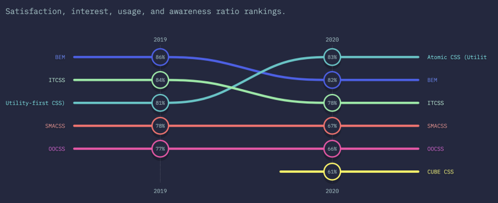
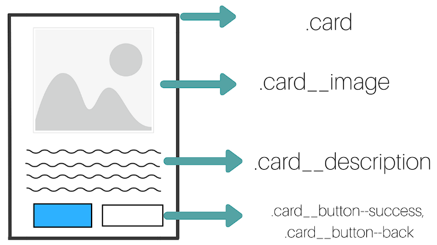
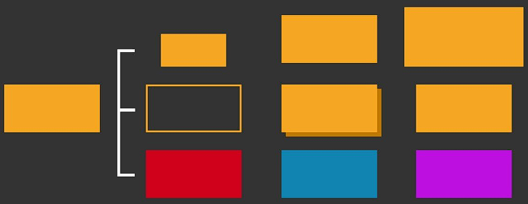

# 方法论
CSS 方法论是一种用于编写模块化、可理解和可扩展的代码的技术。它可以帮助我们编写更可持续和更干净的 CSS 代码。

根据 CSS 状态 2020 的调查结果显示，目前使用最多的五种分别为： BEM、ACSS、OOCSS、SMACSS、ITCSS。



下面就分别看看这五种CSS方法论！

## 1.BEM
BEM 全称为 Block Element Modifier，分别表示块（Block）、元素（Element）、修饰符（Modifier），它是由 Yandex 团队提出的一种 CSS 命名方法。这种命名方法让 CSS 便于统一团队开发规范和方便维护。该方法论由以下三部分组成：
- `Block`：尽量以元素的性质来命名对象，例如：`.list`、`.card`、`.navbar`；
- `Element`：使用 `__` 两个下划线来连接 `Block` 对象，例如：`.list__item`、`.card__img`、`.navbar__brand`；
- `Modifier`：使用 `--` 两个连字符连接 `Block` 或 `Element` 对象，例如：`.list__item--active`、`.card__img--rounded`、`.navbar--dark`。



在 BEM 中并没有那些抽象的规则，它是基于功能为导向（Function-Oriented Programming, FOP）而设计的，不存在像是 `.pl-3` 这种难以理解的 `class` 名称，为了保证 BEM 能够合理的将元素模块化，需要遵守以下规则：
- 不能使用 `class` 以外的选择器来编写样式；
- 不要过度模块化，应该适当控制元素的模组化深度。

### (1)Block 块
所谓的 Block 就是指应用中可独立存在的元素，类似于 SMACSS 中的 Layout 或 Module，这里称其为块。需要遵守以下规范：
- Block 名称需要清楚的表达其用途、功能、意义，且具有唯一性；
- Block 可以放在页面上的任何位置，也可以相互嵌套；
- 单词之间可以使用驼峰形式或者使用 `-` 将其分隔。

参考以下代码：
```css
.list {  }

.card {  }

.navbar {  }

.header {  }
```

### (2)Element 元素
如果把块描述为一个元素，那就可以将 Element 描述为此元素的子元素。参考以下规则：
- Element 名称需要清楚的表达元素的用途及意义；
- Element 和 Element 之间可以相互嵌套；
- Element 与Block 之间使用 `__` 两个下划线连接；
- 单词之间可以使用驼峰式或者使用 `-` 将其分隔。

参考以下代码：
```css
.list__item { }

.card__img { }

.navbar__brand { }

.header__title { }
```

这里需要注意，Element 无法独立于 Block 之外，其存在的目的就是子元素，元素既然不存在，那何来的子元素？如果使用 SCSS 来编写样式，可以改用 & 父选择器来：

```scss
.list {
  display: flex;

  &__item {
    flex: 0 0 25%;
  }
}
```

这样可读性就变好了一些，然后就可以将这些样式应用于 HTML 元素上了：

```html
<ul class="list">
  <li class="list__item"></li>
  <li class="list__item"></li>
  <li class="list__item"></li>
  <li class="list__item"></li>
</ul>
```
BEM 没有过多复杂的概念，而且通过 `class` 名称就可以知道 HTML 元素的结构，更容易理解和使用。

下面再来看一个 Element 相互嵌套的例子：
```html
<ul class="list">
  <li class="list__item">
    <a href="list__item__link"></a>
  </li>
  <li class="list__item">
    <a href="list__item__link"></a>
  </li>
</ul>
```
这也就意味着，所有的子元素都仅仅会被 `.list` 所影响，`link` 不会绑死在 `item` 下，`link` 可以自由的放在 `list` 的任何位置。

### (3)Modifier 修饰符
Modifier 就像 OOCSS 中的 Skin 与 SMACSS 中的 State，主要用来表示 Block 或 Element 的行为及样式。参考以下规范：
- Modifier 名称需要清楚的表达元素样式、状态或行为；
- Modifier 与 Block 或 Element 之间使用 `--` 两个连字符连接；
- 单词之间可以使用驼峰式或者使用 `-` 将其分隔。

参考以下代码：
```css
.list__item--active {  }

.card__img--rounded {  }

.navbar--dark {  }

.header__title--size-s {  }
```
Modifier 也是无法单独存在的，Modifier 必定是作用于某个对象，这里所指的对象可能是 Block 或 Element。如果使用的是 SCSS，可以改用 &父选择器：
```scss
.list {
  display: flex;

  &__item {
    flex: 0 0 25%;

    &--active {
      color: #fffc3d;
    }
  }

  &--dark {
    color: #fff;
    background-color: #272727;
  }
}
```
然后就可以将样式应用在 HTML 元素上了：
```html
<ul class="list list--dark">
  <li class="list__item"></li>
  <li class="list__item list__item--active"></li>
  <li class="list__item"></li>
  <li class="list__item"></li>
</ul>
```
>从上面 HTML 代码中就可以很明显的看到其关联性，很容易的辨认出哪些是 Block，哪些是 Element，哪些是 Modifier，并进一步推断出哪部分的 HTML 可以独立使用，这也是 BEM 的初衷。

## 2.OOCSS

### (1)基本概念
OOCSS 是 Object Oriented CSS 的缩写，意为面向对象的CSS。它是所有 CSS 方法论中最早提出的一个，由 Nicole Sullivan 提出。可以把它理解为将 CSS 模块化。



OOCSS 提倡样式可重用性，在编写 CSS 样式时需要遵循以下规则：
- 应尽量避免使用后代选择器(`.navbar ul`) 或 id 选择器(`#list`)；
- 应尽量避免样式依赖于结构，尝试使用 `class` 替代标签选择器。

### (2)主要原则
OOCSS 有两个主要原则：**结构与样式分离**和**容器与内容分离**。

独立的结构和样式就是把布局样式和设计样式独立出来。实现这一点最好的方式就是使用网格布局系统。

独立的容器和内容所指的是把内容从容器中分离出来，换过句话说任何对象（容器），应该适应接受任何形式的内容。

综合上述，OOCSS最关键的一点就是：提高他的灵活性和可重用性。

这个也是OOCSS最重要的一点。
#### 1)结构与样式分离
全称**Separate structure and skin**

结构与样式之间就像 `.btn` 与 `.btn-primary` 的关系一样。来看例子：
```css
$theme-colors: (
  primary: blue,
  success: green,
);

.btn-primary {
  display: inline-block;
  padding: 0.375rem 0.75rem;
  color: #fff;
  background-color: map-get($theme-colors, primary);
  border: 1px solid map-get($theme-colors, primary);
  border-radius: 0.25rem;
}
```
平时我们可能习惯性的把全部样式都写在同一个`class` 中，就像上面代码一样。此时如果我们需要新增一个主题为 `success` 的按钮呢？你可能会这样做：
```css
.btn-primary {
  display: inline-block;
  padding: 0.375rem 0.75rem;
  color: #fff;
  background-color: map-get($theme-colors, primary);
  border: 1px solid map-get($theme-colors, primary);
  border-radius: 0.25rem;
}

.btn-success {
  display: inline-block;
  padding: 0.375rem 0.75rem;
  color: #fff;
  background-color: map-get($theme-colors, success);
  border: 1px solid map-get($theme-colors, success);
  border-radius: 0.25rem;
}
```

这时，两个按钮就会有很多重复的样式，每增加一个主题的按钮，就需要增加一组样式，这就有点浪费时间了。而 OOCSS 中的结构与样式分离主要就是为了改善这个问题，将以上代码根据 OOCSS 的规范进行改写：
```css
.btn {
  display: inline-block;
  padding: 0.375rem 0.75rem;
  color: black;
  background-color: transparent;
  border: 1px solid transparent;
  border-radius: 0.25rem;
}

.btn-primary {
  color: #fff;
  background-color: map-get($theme-colors, primary);
  border: 1px solid map-get($theme-colors, primary);
}
```

在 OOCSS 的概念中，表现型的 `style` 就属于样式，封装型的 `style` 就属于结构，如下所示：
- 样式(skin)：`color`、`background-color`、`border-color`；
- 结构(structure)：`display`、`box-sizing`、`padding`。

那这样做的用意是什么呢？button 按钮一般是这样来使用这些样式的：
```html
<button class="btn btn-primary"> Primary </button>
```
这样就可以很明确的知道这个元素的结构与样式，以后如果想要增加不同主题的按钮，就只需要编写像`.btn-success`、`.btn-danger`这样的样式类即可，而无需再编写按钮的结构。

当然，也可以借助 Sass 中的 `@each` 来更快速地实现多种主题按钮的样式：
```scss
$theme-colors: (
  primary: blue,
  success: green,
  danger: red,
);

.btn {
  display: inline-block;
  padding: 0.375rem 0.75rem;
  color: black;
  background-color: transparent;
  border: 1px solid transparent;
  border-radius: 0.25rem;
}

@each $key, $value in $theme-colors {
  .btn-#{$key} {
    color: #fff;
    background-color: $value;
    border: 1px solid $value;
  }
}
```
按钮在定义时只需添加对应的样式即可：
```html
<button class="btn btn-primary">Primary</button>
<button class="btn btn-success">Success</button>
<button class="btn btn-danger">Danger</button>
```
相信通过上面的例子，你已经了解了什么是结构与样式分离。如果以 OOCSS 中的 OO (Object Oriented) 来描述的话，这里的结构(Structure)就是所指的元素。以上面例子来说，我们封装了 button 元素，以后如果要使用 button 的话，只需要编写 `.btn` 结构样式名称与对应的样式（skin)即可。

#### 2)容器与内容分离
全称 **Separate container and content**

接下来看看容器与内容该如何分离。容器与内容之间就像 `.card` 与 `.btn` 的关系一样。来看例子：
```css
.card {
  position: relative;
  display: flex;
  flex-direction: column;
  min-width: 0;
  word-wrap: break-word;
}

.card button {
  display: inline-block;
  padding: 0.375rem 0.75rem;
}
```
在编写 CSS 样式时，通常都是根据 HTML 的结构来编写。从上面的代码中可以看出，`.card` 里面有个 `button`。这样编写样式就会失去灵活度，`button` 就完全被绑定在了 `.card` 里面，OOCSS 中的容器与内容分离主要就是用来改善这个问题的，将上面的代码根据 OOCSS 的规范进行改写：
```css
.card {
  position: relative;
  display: flex;
  flex-direction: column;
  min-width: 0;
  word-wrap: break-word;
}

.btn {
  display: inline-block;
  padding: 0.375rem 0.75rem;
}
```

容器与内容分离旨在将两个不同的父子元素给分离出来，借此达到父子元素不相互依赖的目的。且父子元素只存在名称上的关系，实际上两者都可以单独存在并可以在不同的区域使用。这里的 `.card` 就属于容器，`.btn` 就属于内容，如下所示：
- 容器(container)：`.container`、`.col-4`、`.header`；
- 内容(content)：`.btn`、`.input`、`.dropdown`

需要注意，并非所有的元素都必须遵守容器与内容分离的原则，来看下面的例子：
```scss
.col-4 {
  flex: 0 0 100% * (4/12);
  position: relative;
  padding-left: 15px;
  padding-right: 15px;
}

.card {
  position: relative;
  display: flex;
  flex-direction: column;
  min-width: 0;
  word-wrap: break-word;

  &-body {
    margin: 10px auto;
  }
}
```

一个对象可能同时是容器与内容。对于 `.col-4` 对象来说，`.card` 就属于内容，而对于 `.card-body` 对象来说，`.card`就属于容器。那你可能会想，为什么不把 `.card-body` 做分离呢？不是说容器必须与内容作分离吗？这里的 `.card-body` 如果独立存在本身是没有任何意义的，需与`.card` 搭配才会有意义，在这种情况下，`.card-body` 属于 `.card` 的继承，就无须将其分离出来，与前面的`.btn` 不同，`.btn` 独立存在是可以重复使用在其他元素上的。

通过上面的例子，相信大家已经理解了 OOCSS 的基本思想。其实，Bootstrap 就是根据 OOCSS 规范实现的，来看例子：
```html
<nav class="navbar navbar-light bg-light">
  <a class="navbar-brand">Navbar</a>
  <form class="form-inline">
    <input class="form-control mr-sm-2" type="search" placeholder="Search" aria-label="Search" />
    <button class="btn btn-outline-success my-2 my-sm-0" type="submit">Search</button>
  </form>
</nav>
```
可以看到，这段代码中包含了 `.navbar`、`.navbar-light`等 `class`，这些就属于 OOCSS 中的结构与样式分离，而`.form-inline`、`.btn` 等 `class` 就属于容器与内容分离。如果对 OOCSS 方法论感兴趣，可以阅读一下 Bootstrap 的源码，其处理的细腻程度可以说是将 OOCSS 发挥的淋漓尽致。

## 3.SMACSS
SMACSS 全称为 Scalable and Moduler Architecture for CSS，意为可扩展的模块化 CSS 结构，由 Jonathan Snook 提出。SMACSS 不仅包含了**结构与样式分离**的概念，还具有极具特色的**结构化命名**的概念。所谓的结构化命名，就是将元素做结构分类并限制其命名，以此达到易扩展和模块化的目的。

SMACSS 相对于 OOCSS 更偏向于整体结构的分类及模组化 CSS，其中结构的分类包括：
- **Base（基础）**：不需要特别的提供前缀，且不会使用到 class、id 选择器，目的在于设定元素基本样式。例如：`html`、`*:before`、`img`；
- **Layout（布局）**：使用 l- 或 layout- 为次要布局样式提供前缀，目的在于将布局样式与其他样式做区分。例如：`.l-header`、`.l-sidebar`、`.l-grid`
- **Module（模块）**：使用块本身命名为子元素样式提供前缀，目的在于快速了解其相关性。例如：`.card`、`.card-header`、`.card-body`
- **State（状态）**：使用 is- 为状态样式提供前缀，通过语意化方式了解当前状态。例如：`.is-active`、`.is-hidden`、`.is-collapsed`
- **Theme（状态）**：不需要特别的提供前缀，使用对象本身的名称覆盖其原先的主题样式。例如：`.l-header-dark`、`.card-dark`
### (1)Base 规则
Base 主要面向某些对象的基本及预设样式，也就是全局的初始化（重置）样式。在编写这些样式时应该遵循以下规则：
- 可以使用元素选择器、后代选择器、子选择器以及任何伪类将基本样式应用于元素；
- 不应该使用 `class`、`id` 选择器来设置元素预设的样式；
- 不应该使用 `!important` 来设置元素预设的样式（其权重过高，无法被覆盖）。

参考如下代码：
```css
html, form {
  margin: 0;
  padding: 0;
}

*, *:before, *:after {
  box-sizing: border-box;
}

img {
  max-width: 100%;
  height: auto;
}
```

### (2)Layout 规则
SMACSS 中的 Layout 根据重用性将页面划分成**主要布局样式**和**次要布局样式**，主要布局样式是指不发生重用的元素，而次要布局样式就是指会发生重用的元素，在编写样式时应该遵守以下规则：
- 主要布局样式通常使用 `id` 选择器进行设置；
- 次要布局样式通常使用 `class` 选择器进行设置；
- 次要布局样式可提供 `l-` 或 `layout-` 前缀用以将布局样式与基本样式做区分；
- 参考 OOCSS 中的容器与内容分离的概念。

参考如下代码：

```css
#header, #article, #footer {
  width: 960px;
  margin: auto;
}

#article {
  border: solid #CCC;
  border-width: 1px 0 0;
}
```

和 SMACSS 规则不同的是，在 Layout 规则中的主要布局样式是可以使用 id 选择器来定义的。如果想要在特定情况下更改其布局样式，可以与次要布局样式搭配使用：

```css
#article {
  float: left;
}

#sidebar {
  float: right;
}

.l-flipped #article {
  float: right;
}

.l-flipped #sidebar {
  float: left;
}
```

根据 CSS 层叠的特性，可以让元素应用到更高层的布局样式，以覆盖其预设的样式。这里需要注意，所谓的主要布局样式和次要布局样式都只是名称上的定义，不要将自己的思维局限在只能使用主要布局样式，也就是全部使用 id选择器来编写布局样式。大部分情况下，次要布局样式比主要布局样式使用的更多。参考下面的例子：

```html
<div id="featured">
  <h2>Featured</h2>
  <ul>
    <li><a href="…">…</a></li>
    <li><a href="…">…</a></li>
    …
  </ul>
</div>
```

如果不考虑 SMACSS 中的次要布局样式写法，我们可能会为 `div` 添加名为`featured`的`id`，然后通过 `id` 选择器来设置样式：

```css
div#featured ul {
  margin: 0;
  padding: 0;
  list-style-type: none;
}

div#featured li {
  float: left;
  height: 100px;
  margin-left: 10px;
}
```
这样就相当于把元素完全绑定死了，这里的 `#featured` 只能用在`div` 标签上。这不就是 OOCSS 要解决的问题吗？可以根据 SMACSS 中的次要布局样式规则来解决这个问题：
```css
.l-grid {
  margin: 0;
  padding: 0;
  list-style-type: none;
}

.l-grid > li {
  display: inline-block;
  margin: 0 0 10px 10px;
}
```
其实 SMACSS 中的次要布局样式就像是 OOCSS 中的容器与内容分离原则，目的都是将依赖性降到最低。其实对于次要布局样式，就相当于在 OOCSS 的基础上，加上其命名限制中的 -l 前缀就可以了。

### (3)Module 规则
Module 主要面向应用中的可重用元素的样式，与 Layout 不同的地方在于其元素更为准确。基于 Module 的元素都应该以独立元素的方式存在。在编写是需要遵循以下规则：
- 不应该使用元素选择器、`id` 选择器设置元素样式；
- 仅使用 `class` 选择器设置元素样式；
- 使用元素本身命名为子元素样式提供前缀；
- 参考 OOCSS 中的结构与样式分离概念。

参考如下代码：
```html
<div class="card">
  <div>Card Header</div>
  <div>Card Footer</div>
</div>
```
这时我们可能会这样编写样式：
```css
.card > div {
  padding-left: 20px;
}
```
这样写的问题在于，`.card` 中的 `div` 被绑定死了，如果想要针对里面不同的 `div` 编写样式，就需要做出调整。SMACSS 中的 Module 建议都使用 `class` 选择器来编写样式：
```css
.card-header {
  padding-left: 20px;
}

.card-footer {
  padding-left: 20px;
}
```

这样就解决了 div 被绑定死的问题，同时代码的可读性也增加了。SMACSS 的作者建议不要使用`div`、`span`这种元素选择器来定义样式，而是使用 `class` 选择器来强调语意化及可重用性。继续来看下面的例子：
```css
.pod {
  width: 100%;
}
.pod input[type='text'] {
  width: 50%;
}
#sidebar .pod input[type='text'] {
  width: 100%;
}
```

前面提到，基于 Module 的元素应该能够在应用的任意部分使用。这时编写的的样式就会像上面的代码这样，代码越来越复杂，可能一不小心就忽略了CSS的优先级，导致样式被错误的覆盖。SMACSS 建议使用以下方式来写：

```css
.pod {
  width: 100%;
}

.pod input[type='text'] {
  width: 50%;
}

.pod-constrained input[type='text'] {
  width: 100%;
}
```

然后为指定对象添加元素与子元素 class 名称：

```html
<div class="pod pod-constrained">...</div>
```

其实它的概念就像 OOCSS 中的结构与样式分离，只不过这里称之为子类化（Subclassing），通过将样式抽离出来，以后再不同元素中使用模块时，只需要添加模块名称与子类化模块名称即可。

### (4)State 规则
State 主要面向 Layout 或 Module 在应用上的特效及动作，其概念类似于 BEM 中的Modifier，为了保证样式可以作用于对象，允许使用 `@important`。在编写时可以参照以下规则：
- State 可以嵌套在 Layout 或 Module 中；
- 可以使用 JavaScript 改变样式；
- 提供 is- 前缀用以区分此样式为状态样式；
- 可以合理的使用 `!important` 来覆盖样式；


参考如下代码：
```html
<ul class="nav">
  <li class="nav-item">
    <a class="nav-link is-active" href="#">Link</a>
  </li>
  <li class="nav-item">
    <a class="nav-link" href="#">Link</a>
  </li>
  <li class="nav-item">
    <a class="nav-link is-disabled" href="#">Link</a>
  </li>
</ul>
```
与上面介绍的子模块样式不同的地方在于，状态样式不需要继承于任何对象，而只是单纯的将样式应用于对象，可以参考 Bootstrap 中的 `.active` 或 `.disabled` 样式，作用就类似于上面的 `is-active` 与 `is-disabled`，为了保证状态样式可以作用于指定对象，在 State 中允许使用 `@important`。

### (5)Theme 规则
Theme 主要面向应用中为主视觉定义的 Layout 或 Module 样式，例如主题切换。在编写时需要遵循以下规则：
- 直接使用 Layout 或 Module 定义的 `class` 覆盖其样式。

参考如下代码：
```css
// index.css
.mod {
  border: 1px solid;
}

// themeA.css
.mod {
  border-color: blue;
}
```

这里需要注意，不需要使用独立的 `class` 去添加主题样式，在 Theme 的规则中建议使用与原来 Layout 或 Module 中相同的样式名称，而 `themeA.css` 样式会在 `index.css` 之后才加载，这样就可以达到覆盖样式的目的，如果应用中有很多主题样式，也只需要新增像 `t`hemeB.css` 这样的样式文件即可：
```css
.mod {
  border-color: red;
}
```

## 4.ITCSS
ITCSS 全称为 **Inverted Triangle CSS**，意为倒三角CSS，由 Harry Robers 开发。ITCSS 是一种可扩展和可管理的架构，独立于预处理器存在。它出现的主要目的是帮助组织项目的 CSS 文件，从而解决由级联和选择器的特殊性引起的问题。

ITCSS 的目标是通过分层组织 CSS 文件，实现了自下而上的特异性。它基于分层的概念把项目中的样式分为七层：


上层定义的代码比下层定义的代码影响更大。因此，上层会影响下层，下层不会影响上层。下层将继承上级的样式，越往下越具体。

ITCSS 通过三个关键指标对 CSS 项目进行排序：
- 通用到显式（explicitness）：在 ITCSS 的分层中，每一层的权重是越来越大，作用的范围越来越小。从通用的规则到非常明确的规则；
- 低特异性到高特异性（specificity）：开始的时候选择器具有最低的特异性（优先级），随着层数的增加，特异性也在不断变大。因此，要尽量避免在低特异性选择器之前编写高特异性选择器；
- 深远到本地化（reach）：上层定义的样式会影响很多HTML的表现，随着层数的增加，影响范围逐渐减小。


### (1)SETTINGS
第一层 SETTINGS 表示设置，这一层包含项目的所有全局设置。通常会定义一些全局变量，例如颜色、字体大小等，这一层不会生成实际的 CSS。
```scss
$main-color: #6834cb;
$main-font-size: 24px;
```
### (2)TOOLS
第二层 TOOLS 表示工具，如果使用了预处理器，可以在这一层定义 function 和 mixins。Tools 层位于 Settings 层之后，因为 mixin 可能需要全局设置中的一些变量来作为默认参数。同样，这一层也不会生成实际的 CSS。
```scss
@function sum($numbers...) {
  $sum: 0;
  @each $number in $numbers {
    $sum: $sum + $number;
  }
  @return $sum;
}

@mixin sample-mixin () {
  ...
}
```

### (3)GENERIC
第三层 GENERIC 表示通用，可以在这一层来定义重置或者标准化浏览器的基本样式，这一层很少会被修改。这也是第一个实际会生成 CSS 的层。
```scss
* {
  padding: 0;
  margin: 0;
}

*,
*::before,
*::after {
  box-sizing: border-box;
}
```

### (4)ELEMENTS
第四层 ELEMENTS 表示元素，通常用来定义影响 HTML 单个标签的样式，例如 h1、p 标签的默认样式：
```scss
h1 {
  color: $main-color;
  font-size: $main-font-size;
}
```
### (5)OBJECTS
第五层 OBJECTS 表示对象，可以在这一层定义整个项目中可重用的页面结构类。与上一层相比，这一层对 DOM 的影响更小，具有更高的特异性（优先级），并且更加明确，因为现在将 DOM 的部分作为目标来设置了样式。
```css
.grid-container {
  display: grid;
  grid-template-columns: auto auto auto auto;
}
```
### (6)COMPONENTS
第六层 COMPONENTS  表示 UI 组件，与对象不用，组件是页面的特定部分。比如搜索框的样式，为组件定义的样式只会影响到对应的组件。这一层比上一层更加明确，因为现在为 DOM 设计了明确的样式。
```scss
.c-btn {
  display: flex;
  justify-content: center;
  align-items: center;
  ...

  &--primary {
    background-color: #ff5959;
    color: #fff;
  }

  &--large {
    font-size: 16px;
    padding: 16px 14px;
    ...
  }
}
```
### (7)TRUMPS
这一层也称为 Utilities，包含所有那些覆盖之前层中定义的任何其他规则的规则。它是唯一允许使用 `!important` 的层。
```css
.d-none {
  display: none!important;
}
```
### (8)项目结构
**每一层一个文件夹：**
- dataAnalysis
  - components
    1. __all.scss
    2. _buttons.scss
    3. _content.scss
  - elements
    1. __all.scss
    2. _code.scss
    3. _fonts.scss
  - generic
    1. __all.scss
    2. _normalize.scss
    3. _reset.scss
  - objects
    1. __all.scss
    2. _grid.scss
    3. _plain-list.scss
  - settings
    1. __all.scss
    2. _colors.scss
    3. _config.scss
  - tools
    1. __all.scss
    2. _functions.scss
    3. _mixins.scss
  - trumps
    1. __all.scss
    2. _hide.scss
    3. _layout.scss
  - app.scss

**文件名使用层的名字作为前缀：**
- css
  1. _components.avatars.scss
  2. _components.buttons.scss
  3. _componenets.content.scss
  4. _componenets.page-title.scss
  5. _elements.images.scss
  6. _elements.links.scss
  7. _elements.lists.scss
  8. _generic.reset.scss
  9. _generic.box-sizing.scss
  10. _generic.normalize.scss
  11. _objects.layout.scss
  12. _objects.grid.scss
  13. _objects.media.scss
  14. _settings.colors.scss
  15. _settings.config.scss
  16. _tools.mixins.scss
  17. _trumps.links.scss

在使用样式时，就需要按照层的顺序来引用这些 CSS，就像这样：
```css
@import "settings.global.scss";
@import "settings.colors.scss";

@import "tools.functions.scss";
@import "tools.mixins.scss";

@import "generic.box-sizing.scss";
@import "generic.normalize.scss";

@import "elements.headings.scss";
@import "elements.links.scss";

@import "objects.wrappers.scss";
@import "objects.grid.scss";

@import "components.site-nav.scss";
@import "components.buttons.scss";
@import "components.carousel.scss";

@import "trumps.clearfix.scss";
@import "trumps.utilities.scss";
@import "trumps.ie8.scss";
```
## 5.SCSS
ACSS 的全称为 Atomic CSS，意为原子CSS。它专注于创建很多小型的 CSS 样式类，以便在 HTML 上使用。这种方法旨在提供高度精细和可重用的样式，而不是为每个组件提供规则。这可以减少特异性（优先级）冲突并以可预测的方式使样式更具可变性。这种方法有助于减少代码冗余和覆盖 CSS 样式的混淆。

参考以下代码：
```css
.mb-sm { margin-bottom: 16px; }
.mb-lg { margin-bottom: 32px; }
.color-blue { color: #1e90ff; }
```

在HTML中这样来使用：
```html
<div class="mb-lg">
  <p class="mb-lg color-blue">Blue text</p>
  
</div>
```

ACSS 有一些编程方法，可以根据用户添加到 HTML 的类或属性自动生成 CSS。([atomizer] https://github.com/acss-io/atomizer) 就是这样的一个工具，它允许将 HTML 进行如下定义：
```html
<div class="Mb(32px)">
 <p class="Mb(32px) C(#1e90ff)">Blue text</p>
 
</div>
```
这样在构建时就会自动生成以下CSS：
```css
.Mb\(16px\)   
{ margin-bottom: 16px; }
.Mb\(32px\)   
{ margin-bottom: 32px; }
.C\(#1e90ff\) { color: #1e90ff; }
```
> 注意，单独使用 ACSS 会导致类的数量多到难以管理，并且 HTML 结构会非常臃肿。因此，通常只会使用 ACSS 原则来创建定义一致、可重用的声明块的辅助类。
