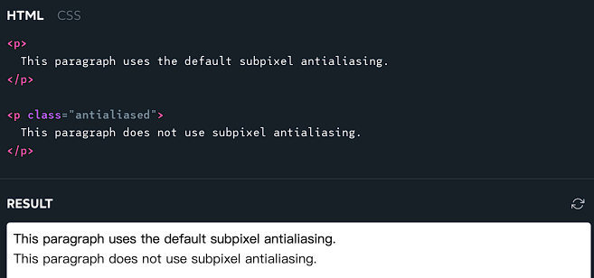

# 样式重置
当开始一个新的前端项目时，首要任务就是重置 CSS 中的一些默认样式。下面就来看看现代 CSS 重置的最佳实践。我们将深入研究每条规则，以了解它的作用和使用它的原因！


下面是自定义的 CSS 重置代码：

```css
/*
  1. 使用更直观的 box-sizing 模型
*/
*, *::before, *::after {
  box-sizing: border-box;
}
/*
  2. 移除默认 margin
*/
* {
  margin: 0;
}
/*
  3. 在应用中允许基于百分比的高度
*/
html, body {
  height: 100%;
}
/*
  排版调整
  4. 添加无障碍行高
  5. 改进文本渲染
*/
body {
  line-height: 1.5;
  -webkit-font-smoothing: antialiased;
}
/*
  6. 改进媒体默认设置
*/
img, picture, video, canvas, svg {
  display: block;
  max-width: 100%;
}
/*
  7. 删除内置表单排版样式
*/
input, button, textarea, select {
  font: inherit;
}
/*
  8. 避免文字溢出
*/
p, h1, h2, h3, h4, h5, h6 {
  overflow-wrap: break-word;
}
/*
  9. 创建根层叠上下文
*/
#root, #__next {
  isolation: isolate;
}
```

这里的代码较短，但是这个小样式表中包含了很多内容。 下面来逐条介绍！
> - 从历史上看，CSS 重置的主要目标是确保浏览器之间的一致性，并撤消所有默认样式。 这段 CSS 重置代码并没有真正做这些事情。
> - 如今，浏览器在布局或间距方面没有太大的差异。 总的来说，浏览器准确的实现了 CSS 规范，并且一切都如你期望的那样，所以它不再是必要的了。
> - 这里的 CSS 重置可能不符合“CSS重置”的经典定义，但这会发挥其创造性！

## 1.box-sizing 模型
先来看一段代码，假设没有应用其他 CSS，以下场景中的 `.box` 元素有多宽？
```html
<style>
  .parent {
    width: 200px;
  }
  .box {
    width: 100%;
    border: 2px solid hotpink;
    padding: 20px;
  }
</style>

<div class="parent">
  <div class="box"></div>
</div>
```

这里的 .box 元素的宽度为：100%。 因为它的父级宽度为 200px ，所以 100% 将解析为 200px。但是它在哪里应用了 200px 的宽度呢？ 默认情况下，它将该大小应用于内容区域，即下图中白色的区域：


width: 100% 声明会将 .box 的内容框设置为 200px。 而 padding 将增加额外的 40 px（每边 20 px）。 border 将增加额外的 4px（每边 2px）。 当进行计算时，粉红色矩形的宽度将是 244 px。

当尝试将 244px 的框塞入宽度为 200px 的父级时，就会发生溢出：


我们可以通过设置以下规则来更改这种奇怪的行为：
```css
*, *::before, *::after {
  box-sizing: border-box;
}
```

应用此规则后，百分比将根据 border-box 进行解析。 在上面的例子中，粉色框宽度为 200 px，内部内容框的宽度将缩小到 156 px（200 px - 40 px - 4 px）。

这是一条必须具备的规则，它使 CSS 更好用。这里使用通配符选择器 (*) 将它应用于所有元素和伪元素。与人们普遍的看法相反，这对性能来说并不坏。

网络上有一些人建议改为执行以下操作：

```css
html {
  box-sizing: border-box;
}
*, *:before, *:after {
  box-sizing: inherit;
}
```

如果i正在尝试迁移一个大型的已经存在的项目以使用 border-box，这可能是一个有用的策略。 如果要从头开始一个全新的项目，这就是没有必要的。 为了简单起见，上面的 CSS 重置中省略了它。

那在什么时候，这是有用的呢？下面来看一个可能有用的示例。

如果您正在尝试迁移一个大型的预先存在的项目以使用 border-box，这可能是一个有用的策略。 如果您要从头开始一个全新的项目，则没有必要。 为了简单起见，我在 CSS 重置中省略了它。

展开以查看何时可能有用的示例。首先，将 `legacy` 的 `box-sizing` 属性设置为 `content-box`，即 `box-sizing` 属性的默认值：
```css
.legacy {
  box-sizing: content-box;
}
```
然后，当应用有一部分尚未迁移到使用 border-box 时，可以将类这样放：

```html
<body>
  <header class="legacy">
    <nav>
      <!-- 遗留的内容在这里 -->
    </nav>
  </header>
  <main>
    <section>
      <!-- 现代的内容在这里 -->
    </section>
    <aside class="legacy">
      <!-- 遗留的内容在这里 -->
    </aside>
  </main>
</body>
```

这里，`<header>` 被赋予了 `legacy` 类，因此它使用 `box-sizing: content-box`。它的子元素 `<nav>` 具有 `box-sizing: inherit`。 因为它的父级设置为 `content-box`，所以 `nav` 也将设置为 `content-box`。

`<main>` 标签没有 `legacy` 类，因此它继承自其父类 `<body>`。 `<body>` 继承自 `<html>`。 `<html>` 被设置为了 `border-box`。

本质上，每个元素现在都会从其父元素中找出其 `box-sizing` 的行为。 如果它有一个设置 `legacy` 类的祖先，它将是 `content-box`。 否则，最终会继承 `html` 标签，即使用 `border-box`。

## 2.移除默认 margin
```css
* {
  margin: 0;
}
```
通常，浏览器会围绕 margin 做出常识性假设。 例如，默认情况下，h1 将包含比 p 更多的边距。这些假设在处理文档文字的上下文中是合理的，但对于现代 Web 应用而言可能并不准确。

我们可能通常希望元素默认是没有任何边距的，所以就把默认的边距全部删除了。当确实想为特定标签添加一些边距时，可以在自定义样式中来添加。 通配符选择器 (*) 的特异性极低，因此很容易覆盖此规则。

## 3.基于百分比的高度
```css
html, body {
  height: 100%;
}
```
你有没有试过在 CSS 中使用基于百分比的高度，却发现它似乎没有效果？下面来看一个例子：


这里 main 元素具有 100% 的高度，但是元素根本没有变长。这是行不通的，因为在流式布局（CSS 中的主要布局模式）中，高度和宽度的操作原理完全不同。元素的宽度是根据其父元素计算的，而元素的高度是根据其子元素计算的。

当应用这条规则时，main 元素就可以增长：


如果使用的是像 React 这样的 JavaScript 框架，可能还希望在此规则中添加第三个选择器：框架使用的根级的元素。

例如，在 Next.js 项目中，将规则更新如下：
```css
html, body, #__next {
  height: 100%;
}
```
那为什么要设置基于百分比的 height，而不改用 vh 单位呢？问题就在于 vh 单元在移动设备上无法正常工作； 100vh 将占据超过 100% 的屏幕空间，因为移动浏览器会在浏览器 UI 出现和消失的地方做这件事。未来，新的 CSS 单位将解决这个问题。在那之前，可以使用基于百分比的高度。

## 4.调整行高 
```css
body {
  line-height: 1.5;
}
```
line-height 控制段落中每行文本之间的垂直间距。 默认值因浏览器而异，通常在 1.2 左右。这个没有单位的数字是基于字体大小的，就像 em 单位。行高为 1.2 时，每行高度将比元素的字体大小大 20%。


这就是问题所在：对于有阅读障碍的人来说，这些行挤得太紧了，很难阅读。 WCAG 标准规定行高应至少为 1.5。这个数字确实倾向于在标题和其他大字体元素上产生相当大的行：


你可能希望在标题上覆盖此值。我的理解是 WCAG 标准适用于“正文”文本，而不是标题。

## 5.平滑字体
```css
body {
  -webkit-font-smoothing: antialiased;
}
```
在 MacOS 电脑上，浏览器默认使用“亚像素抗锯齿”。 这是一种旨在通过利用每个像素内的 R/G/B 光使文本更易于阅读的技术。过去，这被视为可访问性的胜利，因为它提高了文本对比度。

在 2018 年发布的 MacOS Mojave 中，Apple 禁用了整个操作系统的亚像素抗锯齿功能。然而，像 Chrome 和 Safari 这样的 MacOS 浏览器默认情况下仍然使用子像素抗锯齿。 我们需要通过将 `-webkit-font-smoothing` 设置为 `antialiased` 来关闭它。

下图中，左侧是关闭之后的效果：


MacOS 是唯一使用子像素抗锯齿的操作系统，因此此规则对 Windows、Linux 或移动设备并没有影响。 如果使用的是 MacOS 计算机，则可以比较两者的实时渲染（没有使用CSS重置）：

```css
p {
  -webkit-font-smoothing: subpixel-antialiased;
  font-family: sans-serif;
}

.antialiased {
  -webkit-font-smoothing: antialiased;
}
```

效果如下：




## 6.媒体默认值
```css
img, picture, video, canvas, svg {
  display: block;
  max-width: 100%;
}
```

在 HTML 中，图像被认为是内联元素。这意味着它应该用在段落中间，像`<em>`或 `<strong>`一样。这与大多数时候使用图像的方式不一致。 通常，对待图像的方式与对待段落、标题的方式相同，都是布局元素。

但是，如果尝试在布局中使用内联元素，就会发生奇怪的事情。 如果你曾经有过一个神秘的 `4px` 间隙，它不是`padding`、`margin`或`border`，它可能是浏览器用行高添加的内联空间。

通过给图片设置 `display: block` 就避免了这种问题。除此之外，还设置了`max-width: 100%`。这样做是为了防止大图溢出，如果它们被放置在了一个不够宽的容器中。大多数块级元素会自动增长/收缩以适应其父元素，但像 `` 这样的媒体元素很特殊：它们被称为替换元素，并且它们不遵循这些规则。

如果图像的原始尺寸为 `800×600`，即使将其放入宽度为 `500px` 的父元素中，其宽度也将是 `800px`。这条规则将防止该图像超出其容器，这可能是更明智的默认行为。

## 7.继承表单控件的字体
```css
input, button, textarea, select {
  font: inherit;
}
```
默认情况下，按钮和输入框不会从其父元素继承排版样式。 相反，它们有自己的怪异风格。例如，`<textarea>` 将使用系统默认的等宽字体。`input` 输入将使用系统默认的无衬线字体。 两者都将选择很小的字体大小（在 Chrome 中为 `13.333px`）。在移动设备上阅读 `13 px` 的文本会很困难。 当聚焦一个小字体的 `input` 时，浏览器会自动放大，让文本更容易阅读。

这是一个不太好的体验：


如果想要避免这种自动缩放行为，输入的字体大小至少需要 1rem / 16px。 下面是解决该问题的一种方法：

```css
input, button, textarea, select {
  font-size: 1rem;
}
```

这的确解决了自动缩放问题，但这这是表面上的。 这个问题的根本原因是：**表单输入不应该有自己的排版样式**。

```css
input, button, textarea, select {
  font: inherit;
}
```
font 是一种很少使用的速记，它设置了一些与字体相关的属性，如 `font-size`、`font-weight`、`font-family`。 通过将其设置为 `inherit`，就指定这些元素与其周围环境中的排版相匹配。只要不为正文设置很小的字体，这样做就可以解决这些问题。 

## 8.自动换行
```css
p, h1, h2, h3, h4, h5, h6 {
  overflow-wrap: break-word;
}
```

在 CSS 中，如果一行中没有足够的空间容纳所有字符，文本将自动换行。默认情况下，算法会寻找“软换行”的机会，这些是算法可以拆分的字符。 在英语中，唯一的软换行机会就是空格和连字符，但这因语言而异。

如果一行中没有任何软换行机会，并且它不适合换行，就会导致文本溢出：


这可能会导致出现水平滚动条，也可能会导致文本与其他元素重叠，或者滑到图像/视频后面。

`overflow-wrap` 属性可以调整换行算法，并允许它在找不到软换行机会时使用硬换行：


除此之外，还可以尝试添加 `hyphens` 属性：
```css
p {
  overflow-wrap: break-word;
  hyphens: auto;
}
```
`hyphens: auto` 使用连字符（在支持它的语言中）来指定硬换行，它使硬换行更加普遍。如果文本列非常窄，这可能是值得的，但它也可能有点分散注意力。所以并没有将其包含在重置中，但值得一试！


## 9.根层叠上下文
```css
#root, #__next {
  isolation: isolate;
}
```
这一项是是可选的。 通常只有在使用像 React 这样的 JavaScript 框架时才需要它。isolation 属性允我们创建一个新的层叠上下文，而无需设置 z-index。这就可以保证某些高优先级元素（例如模态框、下拉菜单、tooltip）将始终显示在应用中的其他元素之上。

我们需要根据使用的框架来调整选择器，该选择器选择的是应用中渲染的顶级元素。例如，create-react-app 使用的是 `<div id="root">`，所以应该使用选择器#root。

最后，再来看一下这些重置样式的完整代码，可以将其复制/粘贴到自己的项目中：

```css

*, *::before, *::after {
  box-sizing: border-box;
}
* {
  margin: 0;
}
html, body {
  height: 100%;
}
body {
  line-height: 1.5;
  -webkit-font-smoothing: antialiased;
}
img, picture, video, canvas, svg {
  display: block;
  max-width: 100%;
}
input, button, textarea, select {
  font: inherit;
}
p, h1, h2, h3, h4, h5, h6 {
  overflow-wrap: break-word;
}
#root, #__next {
  isolation: isolate;
}
```

>参考文章 https://www.joshwcomeau.com/css/custom-css-reset/


