# 溢出问题
今天我们来看看导致 CSS 溢出问题的原因以及该如何修复它们。

## 一、什么是溢出问题？
在平时开发中，我们可能会遇到水平滚动条的问题，尤其是在移动设备上。因为滚动条问题的原因有很多，所以没有直接的解决方案。有些问题可以很快解决，有些需要一点调试技巧。

那什么是溢出问题呢？当水平滚动条无意中出现在网页上，允许用户水平滚动时，就会出现溢出问题。它可能由不同的原因导致。

## 二、如何发现溢出问题？
下面来看看发现溢出问题的常用方法。
### 1. 向左或向右滚动
第一种方法是水平滚动页面。如果能够滚动，那就说明页面有问题。

### 2. 使用 JavaScript 查找比正文更宽的元素
我们可以在浏览器控制台添加如下代码片段，来显示比主体更宽的元素。这对于包含大量元素的页面来说是很方便的。
```js
var docWidth = document.documentElement.offsetWidth;

[].forEach.call(
  document.querySelectorAll('*'),
  function(el) {
    if (el.offsetWidth > docWidth) {
      console.log(el);
    }
  }
);
```

### 3. 使用CSS outline属性
我们可以将CSS的outline属性添加到页面上的所有元素，这样就可以看到哪些元素发生了溢出。

也可以将以下JavaScript代码片段添加到浏览器的控制台中，以给页面上每个元素添加随机颜色的outline。

```js
[].forEach.call($$("*"),function(a){a.style.outline="1px solid #"+(~~(Math.random()*(1<<24))).toString(16)})
```

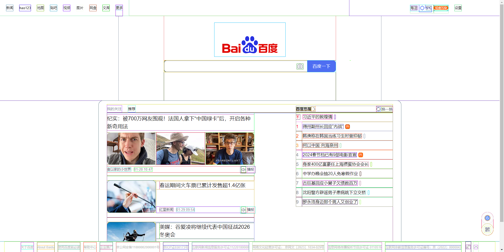

这样就能轻松看出页面上哪个元素发生了溢出。

### 4. Firfox 中的溢出标签
Firefox 有一个很有用的功能，可以告诉我们哪些元素发生了溢出。

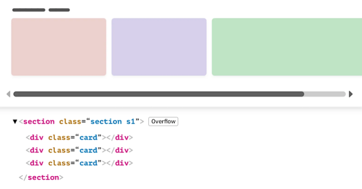

### 5. 删除页面元素
另一种常见的方法是打开浏览器的DevTools，开始逐个删除页面元素。一旦问题消失，那么刚刚删除的部分可能就是倒是溢出问题的原因。我这种方法在你发现问题但不知道为什么会发生的情况下是很有用的。

## 三、常见的溢出问题

### 1. 固定宽度元素
溢出的最常见原因之一是**固定宽度的元素**。一般来说，不要固定会在多个视口大小下显示的元素的宽度。
```css
.element {
    width: 400px;
}
```


### 2. Flex 布局 
在使用 Flexbox 布局时，当没有可用空间时，如果不允许项目换行，那么就可能会发生溢出。
```css
.parent {
    display: flex;
}
```
在这里，如果空间不足以将它们全部放在一行中，Flex 布局的项目就会导致水平溢出：


当 flex 的父对象需要在不同的视口大小下显示时，确保使用 `flex-wrap: wrap`

```css
.parent {
    display: flex;
    flex-wrap: wrap;
}
```

### 3. Grid 布局
在使用CSS grid 布局时，响应式设计是很重要。以下面代码为例：
```css
.wrapper {
    display: grid;
    grid-template-columns: 1fr 300px 1fr;
    grid-gap: 1rem;
}
```
如果视口小于300px，上面的示例将是有效的。否则就会发生溢出。

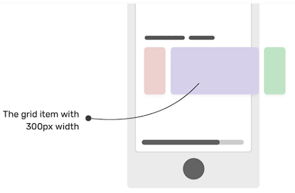

为了避免这样的问题，只有在有足够的可用空间时才使用 grid 布局。我们可以使用如下 CSS 媒体查询：

```css
.wrapper {
    display: grid;
    grid-template-columns: 1fr;
    grid-gap: 1rem;
}

@media (min-width: 400px) {
    .wrapper {
        grid-template-columns: 1fr 300px 1fr;
    }
}
```

### 4. 长单词
溢出的另一个常见原因是不适合视口宽度的长单词。由于视口的宽度，这种情况在移动设备上发生得更多。

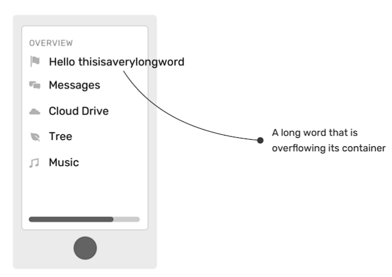

要解决这个问题，我们需要使用 overflow-wrap 属性：

```css
.article-content p {
  overflow-wrap: break-word;
}
```

此修复对于用户输入的内容特别有用。一个完美的例子是评论内容。用户可能会在他们的评论中粘贴一个很长的 URL，我们就应该通过 属overflow-wrap 属性来处理。

### 5. CSS Flex 中的最小内容大小
另一个导致溢出的原因是 Flexbox 中的最小内容大小。这是什么意思？

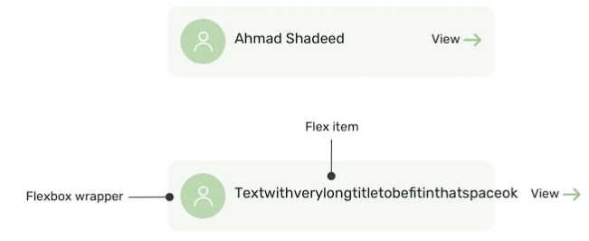

默认情况下，Flex 项目不会缩小到其最小内容大小（最长单词或固定大小元素的长度）以下。要更改此设置，需要设置 `min-width` 或者 `min-height` 属性。

为了解决这个问题，我们可以使用`visible`之外的 `overflow` 值，或者在flex项上设置`min-width:0`

```css
.card__name {
    min-width: 0;
    overflow-wrap: break-word;
}
```
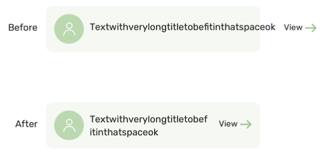

### 6. CSS Grid 中的最小内容大小
与 Flexbox一样对CSS grid 的最小内容大小也有相同的概念。但是，解决方案有所不同。

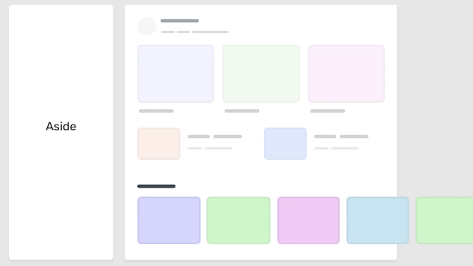

假设有一个带有侧边的 wrapper 和一个带有 CSS grid 的 section。
```css
.wrapper {
    display: grid;
    grid-template-columns: 248px 1fr;
    grid-gap: 40px;
}
```
此外，在 section 有一个滚动部分，这里使用了flexbox。
```css
.section {
    display: flex;
    gap: 1rem;
    overflow-x: auto;
}
```
这里没有添加flex-wrap，因为希望 flex 项目位于同一行。然而，这并没有起作用，却导致了水平溢出。

我们需要使用 `minmax()` 来代替 `1fr`，这样，主元素的最小内容大小就不会是 `auto` 了。

```css
.wrapper {
  display: grid;
  grid-template-columns: 248px minmax(0, 1fr);
  grid-gap: 40px;
}
```

### 7. 负边距
位于屏幕外的元素可能会导致溢出。通常，这是因为元素的外边距为负。在下面的示例中，我们有一个带有负边距的元素，文档的语言是英语（即从左到右）。
```css
.element {
    position: absolute;
    right: -100px;
}
```

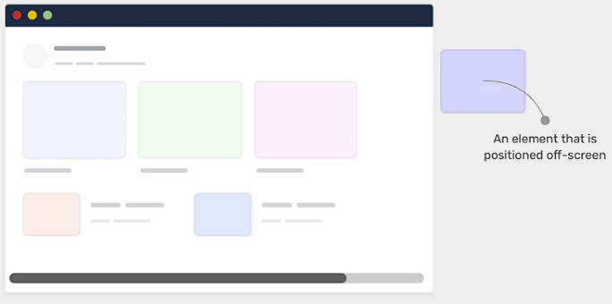

有趣的是，当元素定位在左侧时，就没有发生溢出。这是为什么？

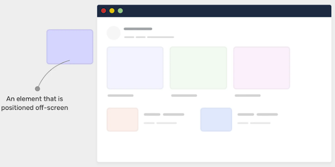

根据 CSS 规范：
> UAs 必须在框的 `block-start` 和 `inline-start`  侧剪切滚动容器的可滚动溢出区域。

对于英文文档，`inline-start` 侧是**左侧**，因此位于左侧屏幕外的任何元素都将被剪裁，因此不会溢出。

如果确实需要将元素放置在屏幕外，请确保将 `overflow: hidden` 应用于父元素以避免任何溢出。

### 8. 没有 max-width 的图片
如果你不提前处理大图像，就可能会看到溢出。确保在所有图像上设置 `max-width: 100%`
```css
img {
    max-width: 100%;
}
```

### 9. 视口单位
使用 `100vw` 有一个缺点，那就是当滚动条可见时，它可能会导致溢出。在macOS上，`100vw` 不会导致水平滚动。

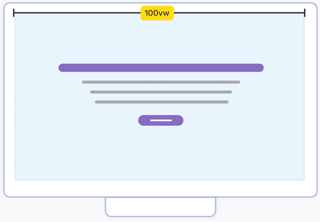

在 Windows 上，默认情况下滚动条总是可见的，因此会发生溢出。

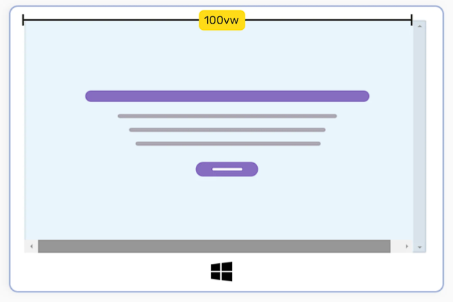

这是因为当值为`100vw`时，用户不知道浏览器垂直滚动条的宽度。因此，宽度将等于`100vw`加上滚动条的宽度。然而，对此 CSS 并没有解决方案去修复它。

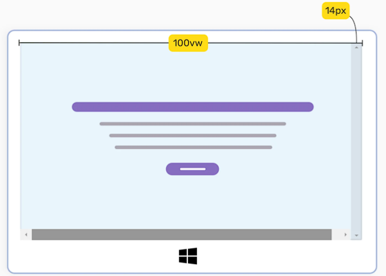

但是，我们可以使用JavaScript来测量视口的宽度，不包括滚动条。

```js
function handleFullWidthSizing() {
  const scrollbarWidth = window.innerWidth - document.body.clientWidth
  document.querySelector('myElement').style.width = `calc(100vw - ${scrollbarWidth}px)`
}
```


