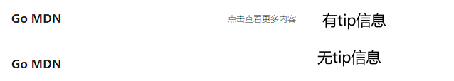
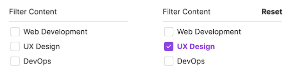
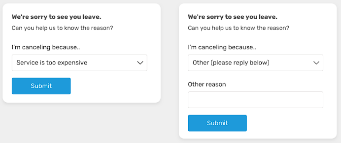
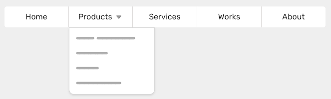
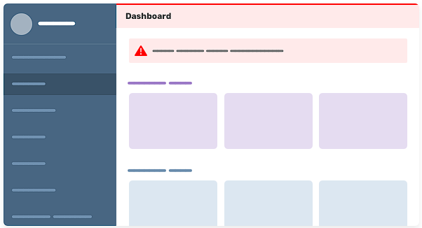

# 父选择器
你有没有想过使用CSS选择器来检查父元素中是否存在特定的元素？例如，如果一个卡片组件中有图片，就给它添加一个`display:flex`。这以前在CSS中是无法实现的，但是新的CSS选择器:has就可以帮助我们选择包含特定元素的父元素。下面来看看这个全新的 CSS 选择器吧！

## :has 选择器概述
在CSS中，我们无法根据元素中是否存在特定的元素来设置父元素的样式，要想实现这一点，就必须创建CSS类，并根据需要进行类的切换。来看下面的例子：


这里我们有两种卡片：包含图片和不包含图片。在CSS中需要这样做：

```css
/* 默认有图片的 */
.card {
    width: 380px;
    height: 100px;
    border-radius: 10px;
    box-shadow: 0px 0px 10px #1677ff;
    padding: 10px;
    box-sizing: border-box;
    display: flex;
}
 .card-banner {
    height: 100%;
    display: block;
}

.card-content {
    display: flex;
    flex-direction: column;
    justify-content: center;
    padding-left: 14px;
}

.card-content-title {
    height: 20px;
    line-height: 20px;
    font-size: 14px;
    font-weight: 600;
}

.card-content-describe {
    font-size: 13px;
    color: #777;
    line-height: 18px;
}

/* 没有图片的 */
.card-nobanner {
    display: block;
    height: auto;
}

.card-nobanner .card-content-title {
    font-size: 16px;
    margin-bottom: 6px;
}

.card-nobanner .card-content {
    padding-left: 0px;
}
```
```html
<!-- 有图片的 -->
<div class="card">
    
    <div class="card-content">
        <div class="card-content-title">SD 生成的动漫图</div>
        <div class="card-content-describe">
            正向参数：
            A girl,
            Black long hair,
            White clothes,
            Rooftop,
            Urban scenery outside the rooftop</div>
    </div>
</div>

<!-- 没有图片的 -->
<div class="card card-nobanner">
    <div class="card-content">
        <div class="card-content-title">SD 生成的动漫图的一些参数</div>
        <div class="card-content-describe">
            正向参数：
            A girl,
            Black long hair,
            White clothes,
            Rooftop,
            Urban scenery outside the rooftop</div>
        <div class="card-content-describe">
            反向参数：
            incomplete,
            low quality</div>
    </div>
</div>
```

这里创建了一个类`card-nobanner`，专门用于没有图片的卡片，在没有图片时就不需要flex布局。如果使用 CSS 中的父选择器 :has 就不需要再写这个类，只需要使用它来检查卡片中是否包含`.card-banner`即可：
```css
.card:has(.card-banner){
    width: 380px;
    height: 100px;
    border-radius: 10px;
    box-shadow: 0px 0px 10px #1677ff;
    padding: 10px;
    box-sizing: border-box;
    display: flex;
}
```
> `father:has(son){}`
> 当father元素中(元素内，子类，后代)中包含son则生效(**针对father元素的样式**)

**根据 CSS 规范，:has 选择器可以检查父元素是否包含至少一个元素，或者一个条件，例如输入是否获取到焦点。**

## :has 选择器不仅与父元素有关
`:has` 选择器不仅可以检查父元素是否包含特定的子元素，还可以检查一个元素后面是否跟有另一个元素：
```css
.card h2:has(+ p) { }
```
这将检查 `<h2>` 元素是否直接跟在 `<p>` 元素之后。

我们也可以将它与表单元素一起使用来检查输入是否获取到了焦点：
```css
form:has(input:focused) {
    background-color: lightgrey;
}
```

## :has 选择器使用示例
下面来看看一些使用`:has`选择器实现页面效果的案例吧！
### 1. 标题样式
当处理章节标题时有两种情况，一种是只包含标题，另一种包含标题和链接。



根据是否有链接来定义不同的样式：

```html
<div class="title">
    <span class="title-content">Go MDN</span>
    <a class="title-tip">点击查看更多内容</a>
</div>
```
```css
 .title{
    display: flex;
    height: 20px;
    line-height: 20px;
    width: 400px;
    padding: 0px 12px;
}
 .title:has(>.title-tip){
    height: 26px;
    justify-content: space-between;
    line-height: 26px;
    border-bottom: 1px solid #ccc;
}
```

这里使用了`:has(>.title-tip)`，它表示只选择直接子元素。

### 2. 卡片布局
有两种类型的卡片操作：一种只有一个操作（链接），另一种具有多个操作（保存、分享等）。


当图片具有多个操作时需要给这些操作添加`display: flex`，可以这样来实现:
```html
<div class="shop-item">
    <div class="shop-item-banner">
        
    </div>
    <div class="shop-item-title">鬼刀公主</div>
    <div class="shop-item-describe">
        《鬼刀》是国内原创绘本漫画，作者为wlop，现连载于哔哩哔哩漫画 [1]、有妖气漫画 [2]，以人类与羽族共同生活的诺拉大陆为故事舞台，讲述了诺拉大陆各方势力的恩怨纠葛。
    </div>
    <div class="shop-item-footer">
        <div class="shop-item-footer-detailLink">Go BaiDu</div>
    </div>
</div>

<div class="shop-item">
    <div class="shop-item-banner">
        
    </div>
    <div class="shop-item-title">wallhaven壁纸</div>
    <div class="shop-item-describe">
        Wallpaper Engine是由Kristjan Skutta所开发的一款动态壁纸软件，区别于其他形式的壁纸软件，Wallpaper Engine可以让用户通过其引擎深度的自定义或编辑来创作出符合个人需求的壁纸样式。
    </div>
    <div class="shop-item-footer">
        <div class="shop-item-footer-share">
            ❤
            😊
        </div>
        <div class="shop-item-footer-more">
            ---
        </div>
    </div>
</div>
```
```css
 .shop{
    display: flex;
    width: auto;
}
.shop-item+
.shop-item{
    margin-left: 20px;
}
.shop-item{
    width: 260px;
    max-height: 360px;
    border-radius: 10px;
    box-shadow: 0px 0px 10px #1677ff;
}
.shop-item-banner{
    width: 100%;
    height: 146px;
    overflow: hidden;
    border-radius: 10px;
    overflow: hidden;
}
.shop-item-banner img{
    height: 100%;
    display: block;
    object-fit: cover; 
}
.shop-item-title{
    margin-top: 6px;
    font-size: 16px;
    color: #333;
    height: 24px;
    line-height: 24px;
    font-weight: 600;
    padding: 0px 6px;
}
.shop-item-describe{
    font-size: 14px;
    color: #777;
    padding: 0px 6px;
    margin-top: 6;
}
.shop-item-footer{
    padding: 12px 6px;
}
.shop-item-footer-detailLink{
    font-size: 14px;
    color: #888;
}
.shop-item-footer:has(.shop-item-footer-share,.shop-item-footer-more){
    display: flex;
    justify-content: space-between;
}
```

### 3. 过滤组件
有一个具有多个选项的组件，当它们没有被选中时，不显示重置按钮。当选中其中一个选项时，显示重置按钮。



可以使用 `:has`选择器轻松实现这个功能：
```css
.btn-reset {
    display: none;
}

.multiselect:has(input:checked) .btn-reset {
    display: block;
}
```

### 4. 显示或隐藏表单元素
有时可能需要根据之前的选择来显示特定的表单字段。 在下面的例子中，当下拉框选中“other”字段时，就展示 other reason 输入框：



使用 CSS `:has` 选择器就可以检查选择菜单是否选择了 other 字段，并在此基础上显示 other reason 输入框：
```css
.other-field {
    display: block;
}

form:has(option[value="other"]:checked) .other-field {
    display: block;
}
```

### 5. 导航栏
有一个带有子菜单的导航栏，当鼠标悬停在菜单项上时展示子菜单：



我们需要做的就是根据是否展示子菜单来显示或隐藏右侧的箭头。可以使用`:has` 选择器轻松实现这一点，这里只需检查`li`元素中是否包含`ul`即可：
```css
li:has(ul) > a:after {
    content: "";
}
```

### 6. 强制警报
在某些仪表板中，可能需要用户必须注意重要警报。在这种情况下，拥有页内警报可能还不够。例如，在这种情况下，可能会为标题元素添加红色边框和暗红色背景色。这样会增加用户快速注意到警报的可能性。 



CSS `:has` 就可以检查`.main`元素是否有警报。如果有，将以下样式添加到标题中：
```css
.main:has(.alert) .header {
    border-top: 2px solid red;
    background-color: #fff4f4;
}
```

